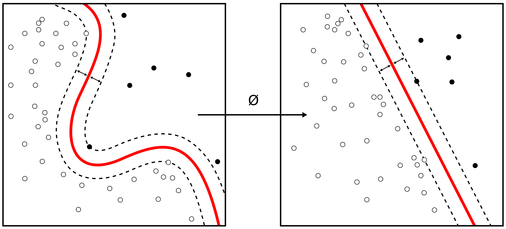

# Mein Test in Markdown

## Foobar

mathe im

$$
    blabla = blu
$$

Bla

- update parameters with learning rate $\alpha$ in negative _gradient direction_:

  $$
  \theta_i^{\mathrm{new}} = \theta_i^{\mathrm{old}}
      - \alpha \frac{\partial \mathbb{C}}{\partial \theta_i}
  $$

- Liste
  $$
  \begin{aligned}
      foo&=bar\\
      bla&=blu
  \end{aligned}
  $$
- Liteee
  $$
    foo=var = \alpha
  $$
- bliasd

  $$
    Foo = Bar
  $$

## Test $$\int_{0}^{4} \dl x < 1$$ 

$$
    \gamma = \int_{0}^\infty e^{-t} \dl t > 0 < 123
$$

## --- MY LONG QUESTION ---

This is a long long Question

It contains multiple paragraphs and some images


and math

$$
    \gamma = \int_{0}^\infty e^{-t} \dl t > 0 < 123
$$

## ---

This is the answer to the long question

## Fragen werden wie üblich in Headern der zweiten Stufe geschrieben.

Antworten kommen direkt drunter.

---

Alles nach dem Trennstrich ist Kommentar und wird nicht beachtet.

## Fragen können auch Bilder enthalten 

Und natürlich auch in der Antwort können Bilder eingefügt werden:


Und in der Antwort geht natürlich auch $Mathe$:

$$
    \gamma = \int_{0}^\infty e^{-t} \dl t > 0 < 123
$$

## Listen und Definitionen

- So
- werden
- Listen
- geschrieben

Definitionen gibts auch:

Apple
: Pomaceous fruit of plants of the genus Malus in
the family Rosaceae.

Orange
: The fruit of an evergreen tree of the genus Citrus.

## Code

Code wird gehighlighted:

```python
def my_function(foo, bar):
    return print("Hello World!")
```
# Foobar

## asdf

baz